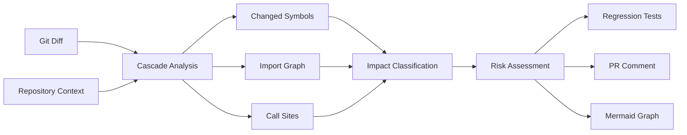

# Cascade — Blast Radius Agent for IBM Bob

[](LICENSE)
[](https://github.com/ibm/bob)
[](https://github.com/raj921/cascade-blast-radius)

**Cascade uses IBM Bob's full-repository context to predict the blast radius of any code change before it merges.**


---

## The Problem

> **CNCF benchmarking 2026**: AI coding agents fix isolated bugs but fail at system-wide impacts.

Current AI coding tools operate on code snippets without understanding the full system context. They can:
- ✅ Fix syntax errors
- ✅ Refactor individual functions
- ✅ Generate boilerplate code

But they **cannot**:
- ❌ Detect cross-service breaking changes
- ❌ Track environment variable dependencies
- ❌ Identify silent runtime failures
- ❌ Predict blast radius of changes

**Result**: Breaking changes merge to production, causing incidents that could have been prevented.

---

## Why IBM Bob?

IBM Bob provides capabilities that snippet-based AI tools cannot match:

1. **🔍 Full Repository Context**
   - Analyzes entire codebase, not just changed files
   - Understands project structure and architecture
   - Tracks dependencies across all services

2. **🔗 Cross-Service Analysis**
   - Follows function calls across service boundaries
   - Detects breaking changes in microservices
   - Maps indirect coupling through configs and env vars

3. **🛠️ Tool Execution**
   - Reads configuration files (`.env`, `docker-compose.yml`)
   - Searches across all files with regex
   - Executes commands to gather runtime context

4. **🧠 Context Retention**
   - Maintains understanding across multiple files
   - Builds complete dependency graphs
   - Remembers project conventions and patterns

**Cascade leverages these capabilities to perform blast-radius analysis that no other tool can.**

---

## 30-Second Quickstart

```bash
# 1. Clone the repository
git clone https://github.com/raj921/cascade-blast-radius.git
cd cascade-blast-radius

# 2. Explore the demo monorepo
cd demo-monorepo
npm install

# 3. View the analysis reports
cat bob-reports/03-demo-auth-change.md
```

That's it! The repository contains complete examples of Cascade's blast-radius analysis.

---

## Demo Scenarios

Cascade includes three comprehensive demos that showcase its capabilities:

### 🔴 Demo 1: The Signature Change (CRITICAL)

**What**: Function return type changes from `boolean` to `object`

**Impact**: Breaks 4 call sites across 2 services, bypasses authentication

**Why It Matters**: Static analyzers miss destructuring patterns and cross-service calls

**Result**: Cascade catches the breaking change and generates regression tests

[View Full Analysis →](bob-reports/03-demo-auth-change.md) | [View JSON →](cascade/demo-outputs/demo-1.json)

---

### 🔴 Demo 2: The Silent Killer (CRITICAL)

**What**: Environment variable renamed (`SMTP_SERVER` → `MAIL_HOST`)

**Impact**: Silent runtime failure in production, email service breaks

**Why It Matters**: No static analyzer can catch this - only runtime context analysis

**Result**: Cascade identifies all config files that need updating

[View Full Analysis →](bob-reports/04-demo-env-var.md) | [View JSON →](cascade/demo-outputs/demo-2.json)

---

### 🟡 Demo 3: The Safe Refactor (MEDIUM)

**What**: Internal implementation change, same signature

**Impact**: Minimal - only rounding behavior changes

**Why It Matters**: Proves Cascade doesn't false-positive on safe changes

**Result**: Cascade correctly identifies this as non-breaking and safe to merge

[View Full Analysis →](bob-reports/05-demo-safe.md) | [View JSON →](cascade/demo-outputs/demo-3.json)

---

## Features

### 🎯 Comprehensive Impact Analysis
- Identifies all callers of changed functions
- Tracks cross-service dependencies
- Detects indirect coupling (env vars, configs)
- Classifies risk levels (CRITICAL, HIGH, MEDIUM, LOW)

### 🧪 Auto-Generated Regression Tests
- Creates Jest tests for all critical call sites
- Tests fail if breaking changes are introduced
- Prevents authentication bypasses and security issues
- Integrates with CI/CD pipelines

### 📊 Visual Blast-Radius Graphs
- Mermaid diagrams showing impact propagation
- Color-coded by risk level
- GitHub-compatible markdown
- Perfect for PR comments and documentation

### 🤖 GitHub Integration
- Professional PR comment templates
- Automated analysis on pull requests
- Clear approve/reject guidance
- Links to detailed reports

---

## Project Structure

```
cascade-blast-radius/
├── bob-reports/              # All Bob prompt outputs
│   ├── 00-setup.md          # Setup documentation
│   ├── 01-architecture.md   # Repository architecture analysis
│   ├── 02-import-graph.md   # Complete import graph (JSON)
│   ├── 03-demo-auth-change.md # Demo 1: Signature change
│   ├── 04-demo-env-var.md   # Demo 2: Environment variable
│   ├── 05-demo-safe.md      # Demo 3: Safe refactor
│   ├── 06-regression-tests.md # Test generation docs
│   ├── 07-pr-comment.md     # PR comment template
│   ├── 08-mermaid-graph.md  # Blast-radius visualization
│   └── 09-readme.md         # README content
├── cascade/
│   └── demo-outputs/        # JSON analysis outputs
│       ├── demo-1.json      # Signature change analysis
│       ├── demo-2.json      # Env var analysis
│       └── demo-3.json      # Safe refactor analysis
├── demo-monorepo/           # Sample microservices codebase
│   ├── services/
│   │   ├── auth/           # Authentication service
│   │   ├── billing/        # Billing service
│   │   └── notifications/  # Email service
│   ├── shared/             # Shared types
│   ├── tests/
│   │   └── regression/     # Auto-generated tests
│   ├── .env                # Environment variables
│   ├── docker-compose.yml  # Docker configuration
│   └── package.json        # Dependencies
└── docs/                   # Documentation assets
```

---

## How It Works



1. **Input**: Git diff + full repository context
2. **Analysis**: Identify changed symbols and traverse dependency graph
3. **Classification**: Assess risk level for each impact
4. **Output**: JSON report, regression tests, PR comment, visual graph

---

## Installation

### Prerequisites
- IBM Bob installed and configured
- Node.js 18+ (for demo monorepo)
- Git

### Setup

```bash
# Clone the repository
git clone https://github.com/raj921/cascade-blast-radius.git
cd cascade-blast-radius

# Install demo dependencies
cd demo-monorepo
npm install

# Run tests
npm test
```

### Create Custom Mode in IBM Bob

1. Open IBM Bob → Settings → Custom Modes
2. Click "New Mode"
3. Name: `cascade-architect`
4. Copy system prompt from [`bob-reports/00-setup.md`](bob-reports/00-setup.md)
5. Save

---

## Usage

### Analyze a Code Change

1. Make your code changes
2. Switch to `cascade-architect` mode in IBM Bob
3. Provide the git diff to Bob
4. Review the generated analysis

### View Example Analyses

```bash
# Demo 1: Breaking signature change
cat bob-reports/03-demo-auth-change.md
cat cascade/demo-outputs/demo-1.json

# Demo 2: Environment variable rename
cat bob-reports/04-demo-env-var.md
cat cascade/demo-outputs/demo-2.json

# Demo 3: Safe refactor
cat bob-reports/05-demo-safe.md
cat cascade/demo-outputs/demo-3.json
```

### Run Regression Tests

```bash
cd demo-monorepo
npm test
```

---

## Output Examples

### JSON Report

```json
{
  "changed_symbols": [
    {
      "file": "services/auth/index.ts",
      "symbol": "verifyToken",
      "kind": "function",
      "old_sig": "function verifyToken(token: string): boolean",
      "new_sig": "function verifyToken(token: string): { valid: boolean; userId: string }"
    }
  ],
  "impacts": [
    {
      "file": "services/billing/checkout.ts",
      "line": 13,
      "symbol": "verifyToken",
      "risk": "CRITICAL",
      "reason": "Boolean check on object always passes - authentication bypassed"
    }
  ],
  "summary": {
    "overall_risk": "CRITICAL",
    "files_affected": 3,
    "cross_service": true
  }
}
```

### Visual Graph

See [bob-reports/08-mermaid-graph.md](bob-reports/08-mermaid-graph.md) for the complete Mermaid diagram.

---

## Documentation

- [Setup Guide](bob-reports/00-setup.md) - Initial setup and custom mode creation
- [Architecture Analysis](bob-reports/01-architecture.md) - Repository structure analysis
- [Import Graph](bob-reports/02-import-graph.md) - Complete dependency graph
- [Demo 1: Signature Change](bob-reports/03-demo-auth-change.md) - Breaking change analysis
- [Demo 2: Environment Variable](bob-reports/04-demo-env-var.md) - Silent failure detection
- [Demo 3: Safe Refactor](bob-reports/05-demo-safe.md) - No false positives
- [Regression Tests](bob-reports/06-regression-tests.md) - Auto-generated test documentation
- [PR Comment Template](bob-reports/07-pr-comment.md) - GitHub integration
- [Mermaid Graphs](bob-reports/08-mermaid-graph.md) - Visual blast-radius diagrams

---

## Key Insights

### What Cascade Catches That Others Miss

1. **Cross-Service Breaking Changes**
   - Function signature changes that break callers in other services
   - No compile-time detection across service boundaries

2. **Silent Runtime Failures**
   - Environment variable renames
   - Configuration file mismatches
   - Docker deployment issues

3. **Indirect Coupling**
   - Shared environment variables
   - JSON payloads between services
   - Database schema dependencies

4. **Security Vulnerabilities**
   - Authentication bypasses from type changes
   - Authorization failures from logic errors

### What Cascade Doesn't False-Positive On

- Internal refactors with unchanged signatures
- Code style improvements
- Comment updates
- Safe behavioral improvements (like better rounding)

---

## Contributing

Contributions are welcome! This project demonstrates the power of IBM Bob for blast-radius analysis.

---

## License

MIT License - see [LICENSE](LICENSE) for details.

---

## Acknowledgments

- **IBM Bob** - For providing full-repository context capabilities
- **CNCF** - For highlighting the need for system-wide impact analysis

---

**Built with ❤️ using IBM Bob**

*Predict the blast radius before it's too late.*