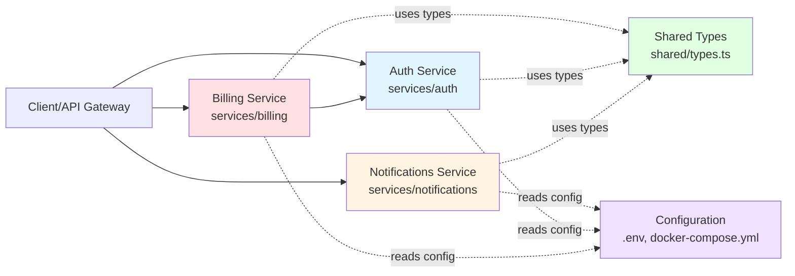

# Architecture Discovery Report

## Repository Analysis: Cascade Demo Monorepo

**Analysis Date**: 2026-05-16  
**Repository**: cascade-blast-radius/demo-monorepo  
**Purpose**: Microservices monorepo for blast-radius analysis demonstration

---

## 1. ENTRY POINTS

### Service Entry Points

1. **Auth Service**
   - **Main File**: `services/auth/index.ts`
   - **Exports**: `verifyToken()`, `authenticate()`, `refreshToken()`
   - **Purpose**: JWT token validation and user authentication

2. **Billing Service**
   - **Main Files**: 
     - `services/billing/checkout.ts` - Payment processing
     - `services/billing/invoice.ts` - Invoice generation
   - **Exports**: `processCheckout()`, `validatePayment()`, `generateInvoice()`
   - **Purpose**: Payment processing and financial operations

3. **Notifications Service**
   - **Main File**: `services/notifications/email.ts`
   - **Exports**: `sendEmail()`, `sendWelcomeEmail()`
   - **Purpose**: Email notification delivery

### Supporting Modules

- **Auth Validator**: `services/auth/validator.ts` - Token validation logic
- **Billing Utils**: `services/billing/utils.ts` - Tax and currency calculations
- **Notification Config**: `services/notifications/config.ts` - SMTP configuration
- **Notification Templates**: `services/notifications/templates.ts` - Email templates
- **Shared Types**: `shared/types.ts` - Common type definitions

---

## 2. SERVICE TOPOLOGY



### Service Dependencies

**Auth Service**
- **Purpose**: Authentication and authorization
- **Dependencies**: None (leaf service)
- **Dependents**: Billing Service
- **External**: JWT_SECRET, JWT_EXPIRY env vars

**Billing Service**
- **Purpose**: Payment processing and invoicing
- **Dependencies**: Auth Service (verifyToken)
- **Dependents**: None
- **External**: None

**Notifications Service**
- **Purpose**: Email delivery
- **Dependencies**: None (leaf service)
- **Dependents**: None
- **External**: SMTP_SERVER, SMTP_PORT, SMTP_USER, SMTP_PASS env vars

---

## 3. SHARED CONTRACTS

### Cross-Service Types (`shared/types.ts`)

1. **User Interface**
   ```typescript
   interface User {
     id: string;
     email: string;
     name: string;
   }
   ```

2. **AuthToken Interface**
   ```typescript
   interface AuthToken {
     token: string;
     expiresAt: Date;
   }
   ```

3. **PaymentMethod Interface**
   ```typescript
   interface PaymentMethod {
     type: 'credit_card' | 'debit_card' | 'paypal';
     last4?: string;
   }
   ```

4. **Invoice Interface**
   ```typescript
   interface Invoice {
     id: string;
     userId: string;
     amount: number;
     tax: number;
     total: number;
     items: InvoiceItem[];
   }
   ```

5. **InvoiceItem Interface**
   ```typescript
   interface InvoiceItem {
     name: string;
     price: number;
     quantity: number;
   }
   ```

### Cross-Service Constants

**Environment Variables** (used by multiple services):
- `NODE_ENV` - Used by all services
- `PORT` - Used by all services
- `DB_HOST`, `DB_PORT`, `DB_NAME`, `DB_USER`, `DB_PASS` - Database config (all services)

**Service-Specific Environment Variables**:
- Auth: `JWT_SECRET`, `JWT_EXPIRY`
- Notifications: `SMTP_SERVER`, `SMTP_PORT`, `SMTP_USER`, `SMTP_PASS`

### Shared Configuration Files

1. **docker-compose.yml**
   - Defines all service containers
   - Sets environment variables
   - Configures networking

2. **.env**
   - Central environment variable storage
   - Used by all services

3. **package.json**
   - Workspace configuration
   - Shared dependencies

4. **tsconfig.json**
   - TypeScript configuration
   - Path aliases for imports

---

## 4. HOTSPOTS

### Top 10 Files by Import Count

1. **`services/auth/index.ts`** (3 importers)
   - Imported by: `services/billing/checkout.ts`, `services/billing/invoice.ts`, `services/auth/index.ts` (self)
   - **Risk Level**: 🔴 CRITICAL
   - **Reason**: Core authentication function used across services

2. **`services/billing/utils.ts`** (2 importers)
   - Imported by: `services/billing/checkout.ts`, `services/billing/invoice.ts`
   - **Risk Level**: 🟡 MEDIUM
   - **Reason**: Shared utility functions within billing service

3. **`services/auth/validator.ts`** (1 importer)
   - Imported by: `services/auth/index.ts`
   - **Risk Level**: 🟢 LOW
   - **Reason**: Internal auth service module

4. **`services/notifications/config.ts`** (1 importer)
   - Imported by: `services/notifications/email.ts`
   - **Risk Level**: 🟠 HIGH
   - **Reason**: Configuration changes can cause silent runtime failures

5. **`shared/types.ts`** (0 direct importers in current code)
   - **Risk Level**: 🟡 MEDIUM
   - **Reason**: Shared type definitions, changes affect type safety

### Blast-Radius Epicenters

**Critical Functions** (changes here have widest impact):

1. **`verifyToken()` in `services/auth/index.ts`**
   - **Direct Callers**: 4 locations
     - `services/billing/checkout.ts:13` (processCheckout)
     - `services/billing/checkout.ts:30` (validatePayment)
     - `services/billing/invoice.ts:11` (generateInvoice)
     - `services/auth/index.ts:23` (refreshToken)
   - **Cross-Service**: YES (Auth → Billing)
   - **Impact**: Breaking change affects entire billing service

2. **`calculateTax()` in `services/billing/utils.ts`**
   - **Direct Callers**: 2 locations
     - `services/billing/checkout.ts:18`
     - `services/billing/invoice.ts:16`
   - **Cross-Service**: NO (internal to billing)
   - **Impact**: Affects all financial calculations

3. **`SMTP_HOST` in `services/notifications/config.ts`**
   - **Direct Users**: 1 location
     - `services/notifications/email.ts:10`
   - **Indirect Dependencies**: .env, docker-compose.yml
   - **Impact**: Configuration mismatch causes runtime failure

---

## 5. HIDDEN COUPLING

### Indirect Dependencies (Non-Typed)

#### Environment Variables

**SMTP_SERVER** (High Risk)
- **Defined in**: `.env:6`
- **Read by**: `services/notifications/config.ts:5`
- **Also referenced in**: `docker-compose.yml:29`
- **Risk**: Renaming breaks docker deployment silently

**JWT_SECRET** (High Risk)
- **Defined in**: `.env:2`
- **Read by**: Auth service (implicit)
- **Also referenced in**: `docker-compose.yml:9`
- **Risk**: Missing or changed value breaks authentication

**Database Credentials** (Medium Risk)
- **Variables**: `DB_HOST`, `DB_PORT`, `DB_NAME`, `DB_USER`, `DB_PASS`
- **Defined in**: `.env:12-16`
- **Referenced in**: `docker-compose.yml:38-40`
- **Risk**: Mismatch between services and database container

#### Configuration Files

**docker-compose.yml Dependencies**
- Service names used as hostnames: `auth:3000`, `postgres:5432`
- Network configuration: `cascade-network`
- Volume mounts: `postgres-data`
- **Risk**: Service name changes break inter-service communication

**Package.json Workspace Configuration**
- Workspace pattern: `services/*`
- **Risk**: Moving services breaks workspace resolution

#### Runtime Behavior Coupling

**Port Assignments**
- Auth: 3001
- Billing: 3002
- Notifications: 3003
- **Risk**: Port conflicts or changes break service discovery

**Service URLs**
- Billing expects Auth at: `http://auth:3000`
- **Risk**: Hardcoded URLs break if service moves

### JSON Payloads (Potential)

While not currently implemented, these services likely exchange JSON:
- Auth tokens (JWT format)
- Invoice data structures
- Email notification payloads

**Risk**: Schema changes without versioning break integrations

### Message Queues (Not Present)

No message queue implementation detected, but would be a hidden coupling point if added.

### Database Schema (Not Visible)

Database schema is referenced but not defined in code:
- **Risk**: Schema changes not tracked in version control

---

## Summary

### Architecture Characteristics

- **Pattern**: Microservices with shared types
- **Communication**: Direct function calls (Auth ← Billing)
- **Configuration**: Centralized (.env) with service-specific overrides
- **Deployment**: Docker Compose orchestration

### Key Risks

1. **Auth Service Changes**: High blast radius due to cross-service usage
2. **Environment Variable Renames**: Silent failures in production
3. **Configuration Drift**: .env vs docker-compose.yml mismatches
4. **Type Safety Gaps**: Environment variables and runtime config

### Recommendations for Cascade Analysis

1. **Track `verifyToken()` changes carefully** - affects multiple services
2. **Monitor environment variable renames** - no static type checking
3. **Watch for docker-compose.yml updates** - affects deployment
4. **Flag any changes to shared types** - affects type contracts

---

**Analysis Complete**  
**Files Analyzed**: 13 TypeScript files, 4 configuration files  
**Services Identified**: 3 (Auth, Billing, Notifications)  
**Critical Dependencies**: 1 cross-service (Auth → Billing)  
**Hidden Coupling Points**: 8 environment variables, 1 docker network