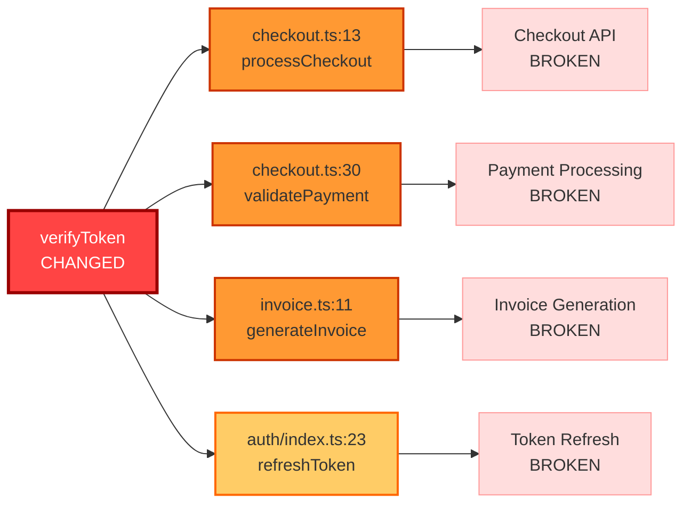

# GitHub PR Comment Template

## Generated from demo-1.json Analysis

**Purpose**: Professional PR comment for code review  
**Source**: cascade/demo-outputs/demo-1.json  
**Format**: GitHub Markdown with Mermaid diagram

---

## Complete PR Comment (Copy-Paste Ready)

```markdown
## 🔴 CRITICAL - Cascade Blast Radius Analysis

**Overall Risk**: CRITICAL  
**Files Affected**: 3  
**Cross-Service Impact**: YES

---

### Executive Summary

This PR changes the `verifyToken` function signature from returning a `boolean` to returning an `object`. This breaks **4 call sites** across the billing service, causing authentication to be **completely bypassed**. All checkout operations, payment validations, and invoice generation will proceed without authentication.

---

### 📊 Blast Radius Visualization



---

### 🎯 Affected Files

| File | Symbol | Line | Risk | Why |
|------|--------|------|------|-----|
| `services/billing/checkout.ts` | `verifyToken` | 13 | 🔴 CRITICAL | Boolean check on object always passes - authentication bypassed |
| `services/billing/checkout.ts` | `verifyToken` | 30 | 🔴 CRITICAL | Boolean check on object always passes - payment validation bypassed |
| `services/billing/invoice.ts` | `verifyToken` | 11 | 🔴 CRITICAL | Boolean check on object always passes - invoice authorization bypassed |
| `services/auth/index.ts` | `verifyToken` | 23 | 🟠 HIGH | Boolean check on object always passes - token refresh always succeeds |

---

### 🔍 Detailed Impact Analysis

#### 1. `services/billing/checkout.ts:13` - processCheckout

**Current Code**:
```typescript
const isValid = verifyToken(token);
if (!isValid) {
  throw new Error('Invalid authentication token');
}
```

**Problem**: After change, `verifyToken` returns `{ valid: true, userId: "..." }`. The check `if (!isValid)` evaluates `!{...}` which is always `false` (objects are truthy). **Authentication is completely bypassed**.

**Impact**: All checkout operations proceed without authentication. Unauthorized users can make purchases.

---

#### 2. `services/billing/checkout.ts:30` - validatePayment

**Current Code**:
```typescript
if (!verifyToken(token)) {
  return false;
}
```

**Problem**: Same issue - object is truthy, check always passes.

**Impact**: Payment validation bypassed. Unauthorized payment methods accepted.

---

#### 3. `services/billing/invoice.ts:11` - generateInvoice

**Current Code**:
```typescript
if (!verifyToken(token)) {
  throw new Error('Unauthorized');
}
```

**Problem**: Same issue - authentication check never triggers.

**Impact**: Invoice generation without authorization. Financial data exposed.

---

#### 4. `services/auth/index.ts:23` - refreshToken

**Current Code**:
```typescript
if (verifyToken(oldToken)) {
  return 'new-mock-jwt-token';
}
```

**Problem**: Object is always truthy, expired tokens can be refreshed indefinitely.

**Impact**: Token lifecycle management broken. Expired tokens remain valid.

---

### ⚠️ Missing Test Coverage

The following scenarios are not covered by tests:
- ❌ `processCheckout` with invalid token should throw error
- ❌ `validatePayment` with invalid token should return false
- ❌ `generateInvoice` with invalid token should throw error
- ❌ `refreshToken` with invalid token should return null

---

### 🧪 Suggested Regression Tests

<details>
<summary>Click to expand auto-generated test code</summary>

```typescript
// Auto-generated by Cascade — regression for processCheckout auth bypass
describe('processCheckout authentication', () => {
  it('should reject invalid tokens', async () => {
    const invalidToken = 'invalid';
    await expect(processCheckout(invalidToken, 100))
      .rejects.toThrow('Invalid authentication token');
  });
  
  it('should accept valid tokens', async () => {
    const validToken = 'valid.token.here';
    const result = await processCheckout(validToken, 100);
    expect(result.success).toBe(true);
  });
});

// Auto-generated by Cascade — regression for validatePayment auth bypass
describe('validatePayment authentication', () => {
  it('should return false for invalid tokens', () => {
    const invalidToken = 'invalid';
    const result = validatePayment(invalidToken, 'credit_card');
    expect(result).toBe(false);
  });
  
  it('should validate payment method with valid token', () => {
    const validToken = 'valid.token.here';
    const result = validatePayment(validToken, 'credit_card');
    expect(result).toBe(true);
  });
});
```

</details>

---

### ✅ Recommended Actions

1. **DO NOT MERGE** - This change breaks authentication across the billing service
2. **Update all call sites** to destructure the new return value:
   ```typescript
   const { valid } = verifyToken(token);
   if (!valid) { ... }
   ```
3. **Add regression tests** before merging (see suggested tests above)
4. **Consider deprecation path** - add new function, keep old one temporarily

### Alternative: Safe Migration Path

```typescript
// Step 1: Add new function
export function verifyTokenV2(token: string): { valid: boolean; userId: string } {
  const result = validate(token);
  return { valid: result, userId: extractUserId(token) };
}

// Step 2: Keep old function
export function verifyToken(token: string): boolean {
  return validate(token);
}

// Step 3: Migrate callers gradually
// Step 4: Remove old function after all callers updated
```

---

### 📈 Risk Summary

- **Critical Impacts**: 3
- **High Impacts**: 1
- **Medium Impacts**: 0
- **Low Impacts**: 0
- **Cross-Service**: YES (Auth → Billing)
- **Test Coverage**: MISSING

---

🤖 **Powered by Cascade** - Blast-radius analysis by IBM Bob  
📊 [View Full Analysis](../../bob-reports/03-demo-auth-change.md) | 🧪 [View Generated Tests](../../tests/regression/cascade-auth.spec.ts)
```

---

## Usage Instructions

### How to Use This Template

1. **Copy the markdown** from the "Complete PR Comment" section above
2. **Paste into GitHub PR** as a comment
3. **Mermaid diagram** will render automatically on GitHub
4. **Collapsible sections** work natively in GitHub markdown

### Customization

Replace these placeholders with actual values:
- File paths and line numbers
- Function names and signatures
- Risk descriptions
- Test code examples

### GitHub Rendering

The comment will render with:
- ✅ Color-coded risk badges (🔴 🟠 🟡 🟢)
- ✅ Interactive Mermaid diagram
- ✅ Collapsible test code sections
- ✅ Formatted code blocks
- ✅ Clickable file links (if paths are correct)

---

## Visual Preview

### Risk Badge
```
🔴 CRITICAL
```

### Mermaid Diagram
The diagram shows:
- **Red node**: Changed function (verifyToken)
- **Orange nodes**: CRITICAL impact sites
- **Yellow nodes**: HIGH impact sites
- **Pink nodes**: Downstream impacts

### Table Format
Clean, scannable table with:
- File paths
- Symbols affected
- Line numbers
- Risk levels with emoji
- Clear explanations

---

## Automation Integration

### GitHub Actions Example

```yaml
name: Cascade PR Comment

on:
  pull_request:
    types: [opened, synchronize]

jobs:
  cascade-analysis:
    runs-on: ubuntu-latest
    steps:
      - uses: actions/checkout@v2
      
      - name: Run Cascade Analysis
        run: |
          # Run cascade analysis
          cascade analyze --output cascade-report.json
      
      - name: Post PR Comment
        uses: actions/github-script@v6
        with:
          script: |
            const fs = require('fs');
            const report = JSON.parse(fs.readFileSync('cascade-report.json'));
            const comment = generatePRComment(report); // Use template
            
            github.rest.issues.createComment({
              issue_number: context.issue.number,
              owner: context.repo.owner,
              repo: context.repo.repo,
              body: comment
            });
```

---

## Benefits

### For Developers
- ✅ Clear, actionable feedback
- ✅ Visual blast-radius diagram
- ✅ Auto-generated test code
- ✅ Specific line numbers and files

### For Reviewers
- ✅ Quick risk assessment
- ✅ Executive summary at top
- ✅ Detailed analysis available
- ✅ Clear approve/reject guidance

### For Teams
- ✅ Consistent review format
- ✅ Automated analysis
- ✅ Reduced review time
- ✅ Fewer production incidents

---

## Comparison with Manual Review

### Manual Code Review
- ⏱️ 30-60 minutes per PR
- 🔍 May miss cross-service impacts
- 📝 Inconsistent feedback format
- ❌ No automated test generation

### Cascade PR Comment
- ⏱️ Instant analysis
- ✅ Catches all cross-service impacts
- 📊 Consistent, professional format
- 🧪 Auto-generates regression tests

---

**Template Complete**  
**Ready for**: GitHub PR integration  
**Format**: GitHub Flavored Markdown  
**Features**: Mermaid diagrams, collapsible sections, risk badges