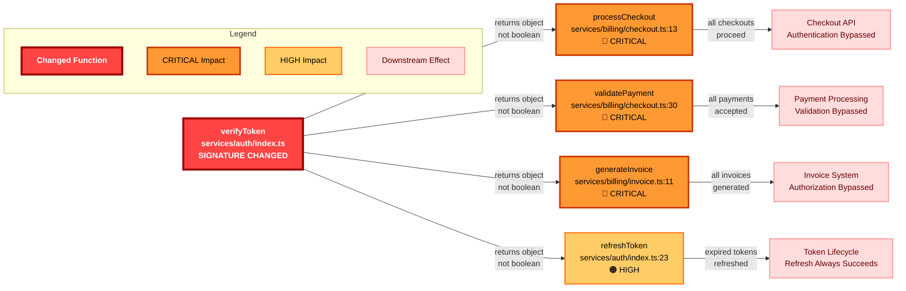
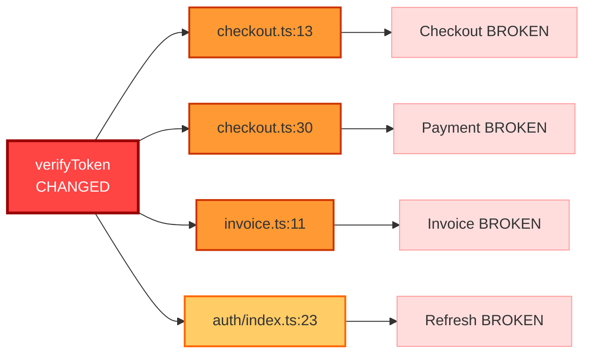
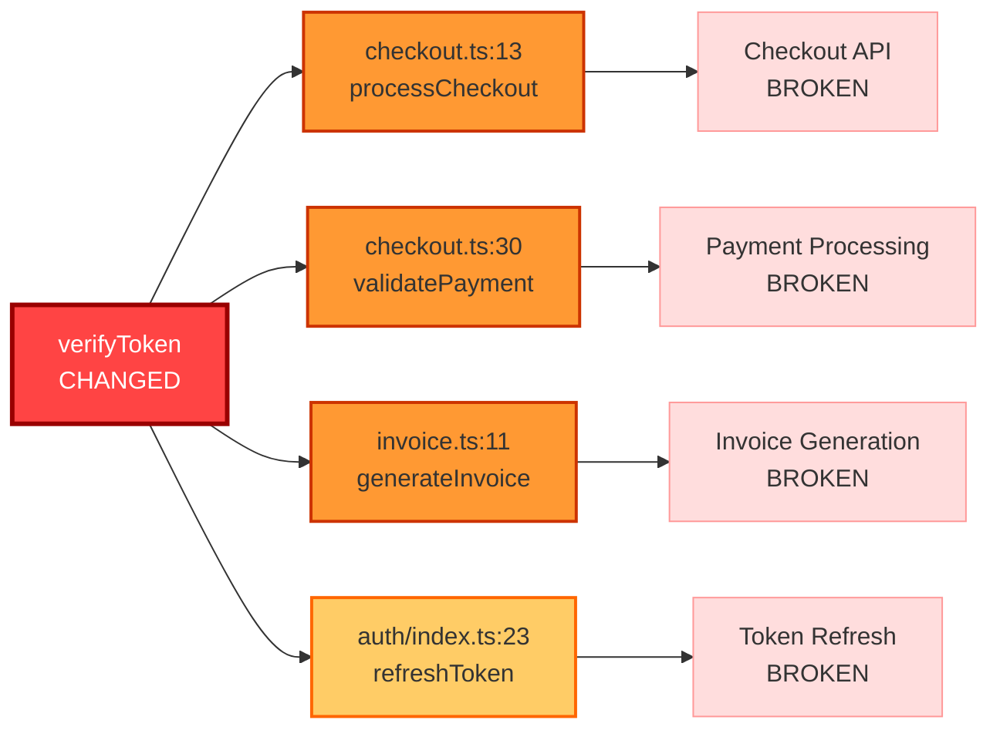
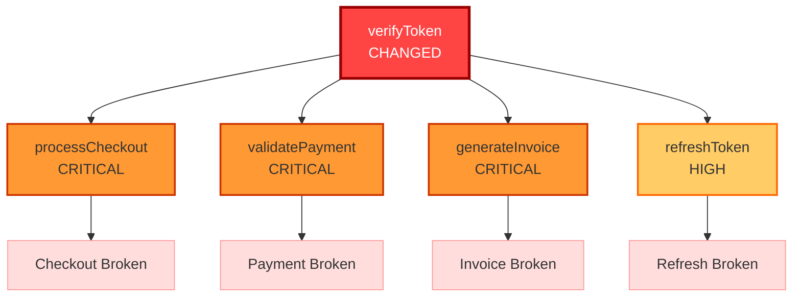
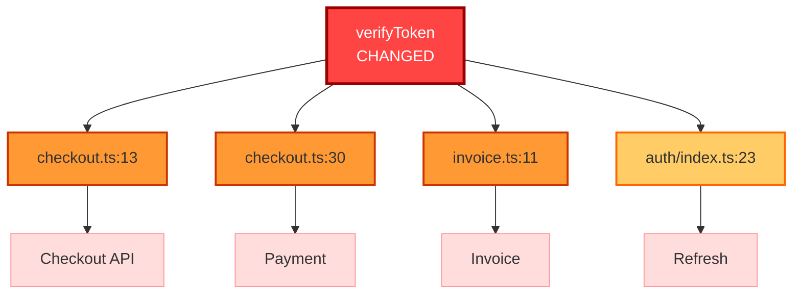

# Standalone Blast-Radius Graph

## Mermaid Diagram for demo-1.json

**Purpose**: Visual representation of blast radius for video/presentation  
**Source**: cascade/demo-outputs/demo-1.json  
**Format**: Mermaid flowchart (Left-to-Right)

---

## Complete Mermaid Code (Copy-Paste Ready)



---

## Simplified Version (For Presentations)



---

## Compact Version (For GitHub Comments)



---

## Color Legend

### Node Colors

| Risk Level | Fill Color | Stroke Color | Usage |
|------------|-----------|--------------|-------|
| **CHANGED** | `#f44` (Red) | `#900` (Dark Red) | The modified function |
| **CRITICAL** | `#f93` (Orange-Red) | `#c30` (Dark Orange) | Breaking changes, security issues |
| **HIGH** | `#fc6` (Orange) | `#f60` (Dark Orange) | Significant impact, needs attention |
| **MEDIUM** | `#ff9` (Yellow) | `#fc0` (Dark Yellow) | Moderate impact, test updates needed |
| **LOW** | `#9f9` (Light Green) | `#6c0` (Dark Green) | Minor impact, safe changes |
| **IMPACT** | `#fdd` (Light Pink) | `#f99` (Pink) | Downstream effects |

### Edge Labels

- **Solid lines**: Direct function calls
- **Dashed lines**: Indirect dependencies
- **Labels**: Describe the relationship or impact

---

## Rendering Instructions

### On GitHub
1. Copy the Mermaid code
2. Paste into a GitHub markdown file or comment
3. GitHub automatically renders Mermaid diagrams

### On mermaid.live
1. Go to https://mermaid.live
2. Paste the Mermaid code
3. Export as PNG or SVG
4. Use in presentations or documentation

### In VS Code
1. Install "Markdown Preview Mermaid Support" extension
2. Open this file in VS Code
3. Use Markdown preview (Cmd/Ctrl + Shift + V)

### In Documentation Sites
Most documentation platforms support Mermaid:
- GitHub
- GitLab
- Notion
- Confluence (with plugin)
- Docusaurus
- MkDocs

---

## Screenshot Instructions

### For Video/Presentation

1. **Render at mermaid.live**:
   - Go to https://mermaid.live
   - Paste complete Mermaid code
   - Adjust zoom for clarity

2. **Export Options**:
   - PNG: For presentations (PowerPoint, Keynote)
   - SVG: For scalable graphics (web, print)
   - URL: For sharing live diagram

3. **Recommended Settings**:
   - Theme: Default or Forest
   - Width: 1920px (for 1080p video)
   - Background: White or transparent

4. **Screenshot Tips**:
   - Use high resolution (2x or 3x)
   - Ensure all text is readable
   - Include legend in frame
   - Crop excess whitespace

---

## Alternative Visualizations

### Vertical Layout (Top-Down)



### Radial Layout (Centered)



---

## Usage in Different Contexts

### 1. GitHub PR Comment
Use the **Compact Version** - fits well in comments, clear and concise

### 2. Video Presentation
Use the **Complete Version** - includes all details, labels, and legend

### 3. Documentation
Use the **Simplified Version** - easier to understand at a glance

### 4. Executive Summary
Use the **Radial Layout** - shows impact spreading from center

---

## Customization Guide

### Adding More Nodes

```mermaid
A --> F[New Impact<br/>Description]:::risk_level
```

### Changing Colors

```mermaid
classDef custom fill:#your_color,stroke:#border_color,stroke-width:2px
```

### Adding Subgraphs

```mermaid
subgraph "Service Name"
    A[Function 1]
    B[Function 2]
end
```

### Edge Styles

```mermaid
A -->|label| B          %% Solid arrow with label
A -.->|label| B         %% Dashed arrow
A ==>|label| B          %% Thick arrow
```

---

## Export Checklist

For video/presentation use:
- [ ] Rendered at mermaid.live
- [ ] Exported as PNG (1920x1080 or higher)
- [ ] All text is readable
- [ ] Colors are distinct
- [ ] Legend is visible
- [ ] No truncated labels
- [ ] Background is appropriate (white/transparent)

For documentation use:
- [ ] Mermaid code is in markdown file
- [ ] Renders correctly on target platform
- [ ] All nodes are labeled clearly
- [ ] Color scheme matches documentation theme

---

## Money Shot Recommendations

### For Demo Video

**Best Version**: Complete Version with Legend

**Why**:
- Shows full context
- Professional appearance
- Clear risk levels
- Includes legend for clarity

**Rendering**:
1. Use mermaid.live
2. Export as PNG at 2x resolution
3. Use as B-roll while explaining
4. Zoom in on specific nodes during narration

### For Thumbnail

**Best Version**: Simplified Version

**Why**:
- Clean and bold
- Easy to read at small sizes
- Immediate visual impact
- Clear "before/after" story

---

## Technical Notes

### Mermaid Version
- Tested with Mermaid v10.0+
- Compatible with GitHub's Mermaid renderer
- Works with most Mermaid-supporting platforms

### Browser Compatibility
- Chrome/Edge: Full support
- Firefox: Full support
- Safari: Full support
- Mobile: May need zoom for details

### Performance
- Renders instantly on modern browsers
- No external dependencies
- Lightweight (< 5KB of text)

---

**Graph Complete**  
**Ready for**: Rendering at mermaid.live  
**Recommended**: Export as PNG for video  
**Resolution**: 1920x1080 or higher