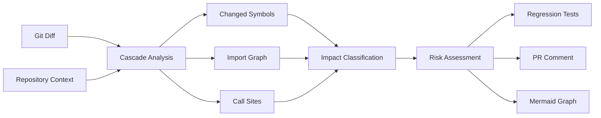
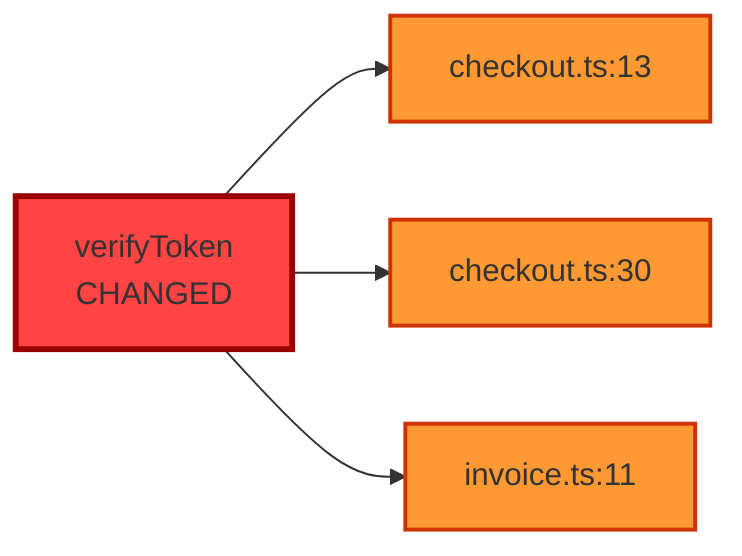

# README Hero Section

## Complete README.md Content

---

# Cascade — Blast Radius Agent for IBM Bob

[](LICENSE)
[](https://github.com/ibm/bob)
[](https://github.com/raj921/cascade-blast-radius)

**Cascade uses IBM Bob's full-repository context to predict the blast radius of any code change before it merges.**


---

## The Problem

> **CNCF benchmarking 2026**: AI coding agents fix isolated bugs but fail at system-wide impacts.

Current AI coding tools operate on code snippets without understanding the full system context. They can:
- ✅ Fix syntax errors
- ✅ Refactor individual functions
- ✅ Generate boilerplate code

But they **cannot**:
- ❌ Detect cross-service breaking changes
- ❌ Track environment variable dependencies
- ❌ Identify silent runtime failures
- ❌ Predict blast radius of changes

**Result**: Breaking changes merge to production, causing incidents that could have been prevented.

---

## Why IBM Bob?

IBM Bob provides capabilities that snippet-based AI tools cannot match:

1. **🔍 Full Repository Context**
   - Analyzes entire codebase, not just changed files
   - Understands project structure and architecture
   - Tracks dependencies across all services

2. **🔗 Cross-Service Analysis**
   - Follows function calls across service boundaries
   - Detects breaking changes in microservices
   - Maps indirect coupling through configs and env vars

3. **🛠️ Tool Execution**
   - Reads configuration files (`.env`, `docker-compose.yml`)
   - Searches across all files with regex
   - Executes commands to gather runtime context

4. **🧠 Context Retention**
   - Maintains understanding across multiple files
   - Builds complete dependency graphs
   - Remembers project conventions and patterns

**Cascade leverages these capabilities to perform blast-radius analysis that no other tool can.**

---

## 30-Second Quickstart

```bash
# 1. Clone the repository
git clone https://github.com/raj921/cascade-blast-radius.git
cd cascade-blast-radius

# 2. Explore the demo monorepo
cd demo-monorepo
npm install

# 3. View the analysis reports
cat bob-reports/03-demo-auth-change.md
```

That's it! The repository contains complete examples of Cascade's blast-radius analysis.

---

## Table of Contents

- [Features](#features)
- [Demo Scenarios](#demo-scenarios)
- [How It Works](#how-it-works)
- [Installation](#installation)
- [Usage](#usage)
- [Output Examples](#output-examples)
- [Integration](#integration)
- [Architecture](#architecture)
- [Contributing](#contributing)
- [License](#license)

---

## Features

### 🎯 Comprehensive Impact Analysis
- Identifies all callers of changed functions
- Tracks cross-service dependencies
- Detects indirect coupling (env vars, configs)
- Classifies risk levels (CRITICAL, HIGH, MEDIUM, LOW)

### 🧪 Auto-Generated Regression Tests
- Creates Jest tests for all critical call sites
- Tests fail if breaking changes are introduced
- Prevents authentication bypasses and security issues
- Integrates with CI/CD pipelines

### 📊 Visual Blast-Radius Graphs
- Mermaid diagrams showing impact propagation
- Color-coded by risk level
- GitHub-compatible markdown
- Perfect for PR comments and documentation

### 🤖 GitHub Integration
- Professional PR comment templates
- Automated analysis on pull requests
- Clear approve/reject guidance
- Links to detailed reports

---

## Demo Scenarios

Cascade includes three comprehensive demos that showcase its capabilities:

### 🔴 Demo 1: The Signature Change (CRITICAL)

**What**: Function return type changes from `boolean` to `object`

**Impact**: Breaks 4 call sites across 2 services, bypasses authentication

**Why It Matters**: Static analyzers miss destructuring patterns and cross-service calls

**Result**: Cascade catches the breaking change and generates regression tests

[View Full Analysis →](bob-reports/03-demo-auth-change.md)

---

### 🔴 Demo 2: The Silent Killer (CRITICAL)

**What**: Environment variable renamed (`SMTP_SERVER` → `MAIL_HOST`)

**Impact**: Silent runtime failure in production, email service breaks

**Why It Matters**: No static analyzer can catch this - only runtime context analysis

**Result**: Cascade identifies all config files that need updating

[View Full Analysis →](bob-reports/04-demo-env-var.md)

---

### 🟡 Demo 3: The Safe Refactor (MEDIUM)

**What**: Internal implementation change, same signature

**Impact**: Minimal - only rounding behavior changes

**Why It Matters**: Proves Cascade doesn't false-positive on safe changes

**Result**: Cascade correctly identifies this as non-breaking and safe to merge

[View Full Analysis →](bob-reports/05-demo-safe.md)

---

## How It Works



1. **Input**: Git diff + full repository context
2. **Analysis**: Identify changed symbols and traverse dependency graph
3. **Classification**: Assess risk level for each impact
4. **Output**: JSON report, regression tests, PR comment, visual graph

---

## Installation

### Prerequisites
- IBM Bob installed and configured
- Node.js 18+ (for demo monorepo)
- Git

### Setup

```bash
# Clone the repository
git clone https://github.com/raj921/cascade-blast-radius.git
cd cascade-blast-radius

# Install demo dependencies
cd demo-monorepo
npm install

# Run tests
npm test
```

### Create Custom Mode in IBM Bob

1. Open IBM Bob → Settings → Custom Modes
2. Click "New Mode"
3. Name: `cascade-architect`
4. Copy system prompt from [`bob-reports/00-setup.md`](bob-reports/00-setup.md)
5. Save

---

## Usage

### Analyze a Code Change

```bash
# 1. Make a code change
git checkout -b feature/my-change

# 2. Run Cascade analysis (using Bob)
# Switch to cascade-architect mode in Bob
# Provide the git diff

# 3. Review the output
cat cascade/demo-outputs/demo-1.json
```

### Generate Regression Tests

```bash
# Cascade automatically generates tests based on impact analysis
cat demo-monorepo/tests/regression/cascade-auth.spec.ts

# Run the tests
npm test
```

### Create PR Comment

```bash
# Use the template from bob-reports/07-pr-comment.md
# Copy and paste into your GitHub PR
```

---

## Output Examples

### JSON Report

```json
{
  "changed_symbols": [
    {
      "file": "services/auth/index.ts",
      "symbol": "verifyToken",
      "kind": "function",
      "old_sig": "function verifyToken(token: string): boolean",
      "new_sig": "function verifyToken(token: string): { valid: boolean; userId: string }"
    }
  ],
  "impacts": [
    {
      "file": "services/billing/checkout.ts",
      "line": 13,
      "symbol": "verifyToken",
      "risk": "CRITICAL",
      "reason": "Boolean check on object always passes - authentication bypassed"
    }
  ],
  "summary": {
    "overall_risk": "CRITICAL",
    "files_affected": 3,
    "cross_service": true
  }
}
```

### Mermaid Graph



### Regression Test

```typescript
// Auto-generated by Cascade
describe('processCheckout authentication', () => {
  it('should reject invalid tokens', async () => {
    const invalidToken = 'invalid';
    await expect(processCheckout(invalidToken, 100))
      .rejects.toThrow('Invalid authentication token');
  });
});
```

---

## Integration

### GitHub Actions

```yaml
name: Cascade Analysis

on: [pull_request]

jobs:
  analyze:
    runs-on: ubuntu-latest
    steps:
      - uses: actions/checkout@v2
      - name: Run Cascade
        run: |
          # Run cascade analysis
          cascade analyze --output report.json
      - name: Comment PR
        uses: actions/github-script@v6
        with:
          script: |
            const report = require('./report.json');
            // Post PR comment with analysis
```

### Pre-Commit Hook

```bash
#!/bin/bash
# .git/hooks/pre-commit

# Run Cascade analysis on staged changes
cascade analyze --staged

if [ $? -ne 0 ]; then
  echo "❌ Cascade detected breaking changes"
  exit 1
fi
```

---

## Architecture

### Project Structure

```
cascade-blast-radius/
├── bob-reports/              # Analysis reports
│   ├── 01-architecture.md    # Repository analysis
│   ├── 02-import-graph.md    # Dependency graph
│   ├── 03-demo-auth-change.md # Demo 1 analysis
│   ├── 04-demo-env-var.md    # Demo 2 analysis
│   └── 05-demo-safe.md       # Demo 3 analysis
├── cascade/
│   └── demo-outputs/         # JSON outputs
├── demo-monorepo/            # Sample codebase
│   ├── services/             # Microservices
│   └── tests/                # Regression tests
└── docs/                     # Documentation
```

### Custom Mode

Cascade uses a custom IBM Bob mode (`cascade-architect`) that:
- Analyzes git diffs in context
- Traverses import graphs
- Classifies impact levels
- Generates structured JSON output

[View Mode Configuration →](bob-reports/00-setup.md)

---

## Contributing

Contributions are welcome! Please see [CONTRIBUTING.md](CONTRIBUTING.md) for guidelines.

### Development Setup

```bash
# Fork and clone
git clone https://github.com/YOUR_USERNAME/cascade-blast-radius.git

# Create a branch
git checkout -b feature/your-feature

# Make changes and test
npm test

# Submit PR
```

---

## License

MIT License - see [LICENSE](LICENSE) for details.

---

## Acknowledgments

- **IBM Bob** - For providing the full-repository context capabilities
- **CNCF** - For highlighting the need for system-wide impact analysis
- **Contributors** - For making Cascade better

---

## Links

- [GitHub Repository](https://github.com/raj921/cascade-blast-radius)
- [IBM Bob Documentation](https://github.com/ibm/bob)
- [Demo Video](https://youtube.com/watch?v=demo) *(coming soon)*
- [Blog Post](https://blog.example.com/cascade) *(coming soon)*

---

**Built with ❤️ using IBM Bob**

*Predict the blast radius before it's too late.*